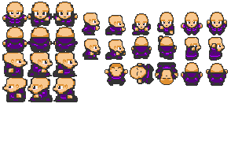

# RPG PUZZLE GAME

>## *Source*

>### *Animations*

The animations are quite easy here we take the image:

and we make it run the ` animate() ` function in `sprites.py` in the `Player` class. 

        down_animations = [self.game.character_spritesheet.get_sprite(3, 2, self.width, self.height),
                           self.game.character_spritesheet.get_sprite(35, 2, self.width, self.height),
                           self.game.character_spritesheet.get_sprite(68, 2, self.width, self.height)]

        up_animations = [self.game.character_spritesheet.get_sprite(3, 34, self.width, self.height),
                         self.game.character_spritesheet.get_sprite(35, 34, self.width, self.height),
                         self.game.character_spritesheet.get_sprite(68, 34, self.width, self.height)]

        left_animations = [self.game.character_spritesheet.get_sprite(3, 98, self.width, self.height),
                           self.game.character_spritesheet.get_sprite(35, 98, self.width, self.height),
                           self.game.character_spritesheet.get_sprite(68, 98, self.width, self.height)]

        right_animations = [self.game.character_spritesheet.get_sprite(3, 66, self.width, self.height),
                            self.game.character_spritesheet.get_sprite(35, 66, self.width, self.height),
                            self.game.character_spritesheet.get_sprite(68, 66, self.width, self.height)]
        if self.facing == "down":
            if self.y_change == 0:
                self.image = self.game.character_spritesheet.get_sprite(3, 2, self.width, self.height)
            else:
                self.image = down_animations[math.floor(self.animation_loop)]
                self.animation_loop += 0.1
                if self.animation_loop >= 3:
                    self.animation_loop = 1
        if self.facing == "up":
            if self.y_change == 0:
                self.image = self.game.character_spritesheet.get_sprite(3, 34, self.width, self.height)
            else:
                self.image = up_animations[math.floor(self.animation_loop)]
                self.animation_loop += 0.1
                if self.animation_loop >= 3:
                    self.animation_loop = 1
        if self.facing == "left":
            if self.x_change == 0:
                self.image = self.game.character_spritesheet.get_sprite(3, 98, self.width, self.height)
            else:
                self.image = left_animations[math.floor(self.animation_loop)]
                self.animation_loop += 0.1
                if self.animation_loop >= 3:
                    self.animation_loop = 1
        if self.facing == "right":
            if self.x_change == 0:
                self.image = self.game.character_spritesheet.get_sprite(3, 66, self.width, self.height)
            else:
                self.image = right_animations[math.floor(self.animation_loop)]
                self.animation_loop += 0.1
                if self.animation_loop >= 3:
                    self.animation_loop = 1`
